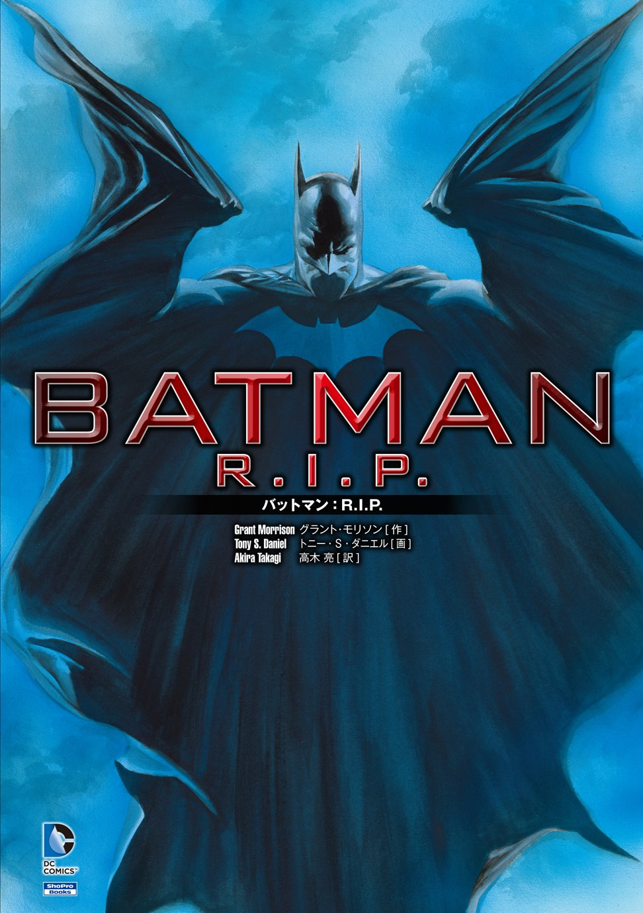

# グラント・モリスン『BATMAN R.I.P.』から読み解く「深淵」と「降下」Zine

  

---

このZineは、これまでに公開した二つのZine――グラント・モリスンの『POP MAGIC!』の中で語られる「深淵（アビス）」と、フィル・ハイン『現代シャーマニズムの技法』に登場する「降下」のプロセス――この二つのコンセプトをより深く理解するための補足解説として位置づけられる。いずれも、魔術における「死と再生」の体験を扱っているが、抽象的で理解が難しい。そこで本Zineでは、これらの概念を、グラント・モリスンが描いたバットマン作品――とくに『BATMAN R.I.P.』――を通じて、具体的な物語構造として読み解いていく。

『BATMAN R.I.P.』では、バットマン＝ブルース・ウェインが精神の崩壊を経て、「ズー・イン・アール」という新たな象徴人格として再構築されるプロセスが描かれる。その冒頭でジョーカーがバットマンに見せるトランプのカード「デッドマンズハンド（死者の手）」や「ジョーカー」が、象徴的なトリガーとして物語の“深淵”への突入を示している。

本書で扱う『BATMAN R.I.P.』は、単なるスーパーヒーロー作品ではない。作者であるグラント・モリスン自身が魔術師であり、この作品自体が彼の魔術的実践＝ハイパーシジルとして構成されているからである。モリスンは、執筆行為を通じて現実に介入し、自身の変容を引き起こそうとする。つまりこの物語には、読者を巻き込む形で儀式構造が埋め込まれているのである。モリスンの魔術観、儀式観を知らずにこの作品を読むことは、表層的なストーリーだけを追ってしまうことにもなるだろう。

**by 知られざる呪術師（*Le Sorcier Inconnu*）**

ディスコーディアン暦3191年 深淵を旅するラクダの祝日 第26火曜日 
――摩天楼の頂上に、コウモリ🦇が舞い降りる日

---

### 『BATMAN R.I.P.』という作品について

この作品はグラント・モリスンによるバットマン・サーガの3部作の第2部にあたる。第1部では、巨大犯罪組織の首領の娘、タリアとの間に生まれた息子、ダミアンが登場する。そして第2部の本作では、ブルース・ウィルス（バットマン）を暗殺するための組織、ブラックグローブが登場する。その戦いの中で、ブルース・ウィルスは肉体的ばかりでなく心理的にも追い込まれ、精神の崩壊を迎える。しかしブルース・ウィルスの精神が消えた肉体は、ズー・イン・アールのバットマンだと名乗って別人格で蘇り、ブラックグローブへの反撃を開始する。これには、かつてブルース・ウィルスが修行を行っていたチベット仏教ゾクチェンのトゥゲルの儀式が関係していた。ブルース・ウィルスは、49日間洞窟にこもり4分間死亡していたのだ。

---

## 目次

# Zine『バットマンとハイパーシジル』章構成案

## はじめに
- 『POP MAGIC!』『現代シャーマニズム』で語られた「深淵」「降下」の補完
- 本Zineの目的＝物語を通じて“深淵”を可視化すること

## 『BATMAN R.I.P.』の概要
- 死と再構成、Zur-En-Arrh人格
- ズー・イン・アールが現れるタイミングの“意味”

## Zur-En-Arrhと人格の断片化
- 「三人のバットマン」というOS的バックアップ人格
- Might（マイト）＝最小の自己
- Zur-En-Arrhは緊急避難用の“セーフモード人格”

## バットラディアの象徴性
- 壊れたラジオという“トリガー”
- マインドの深層に埋め込まれたリセット装置
- 「いつか修理してほしい」という予言的セリフ
- フィクションが現実を起動する魔術的デバイスとしての解釈

## ジョーカーとコロンゾンの問題
- 「道化としてのアビス」：道化・影・反英雄
- モリアーティ＝ジョーカーの台詞の意味

## 魔術的構造との接続
- 『POP MAGIC!』のアビス
- 『Modern Shamanism』の降下と再統合
- ピーター・キャロルのCD「Cosmic Death」と第五の部屋
- NLP／自己トリガー／ゾクチェンのTögalとの対比

## 補遺：背景と補助資料
- 『バットマン・アンド・サン』『ブラックグローブ』
- トゥゲル実践（洞窟と死の模倣）
- スーパーゴッズ／先行論文要約

## 終章：読む者のためのアビス
- モリスンの書いた“ハイパーシジル”
- Zineを書くこと＝筆者自身の深淵体験
- 読者を象徴の再構成へ導く装置としてのZine
---

## 参考文献解説

[論文「The Dark Knight of the Soul」](dark_knight_of_the_soul_summary.md)

[CD Chaos Magick Audios CD: Volume I: Cthonos Meditation by Peter J Carroll](https://www.amazon.co.jp/Chaos-Magick-Audios-CD-Meditation/dp/1935150464/ref=sr_1_6?__mk_ja_JP=%E3%82%AB%E3%82%BF%E3%82%AB%E3%83%8A&crid=BNWH0RDRTBSS&dib=eyJ2IjoiMSJ9.KE1jqjv1J9alJrUVlxX5-Pqmk6WY1xL-nu1J51WadV5UwgVL20Oao6U_QQREySicTocOTUiWPy6mWIQ5bKzqIUNOjOYtILBenF3Bw10VPwc_818J2Cnqi3zy4YBNj6EdqrNXiewQi3EYMvatEmOhvBZwH_bw0vzzTHcjwcfTvFnPgn29aXHHYIOs8ktQ82cMxOS8yyKrnJYv4AYZTdiaU2Jp9lE-P4iQ07kvSJVCcYrJuuHuCXy0zd9Bz4R_VgKfRtsq_adoY8YyhykhXjuj6Zav5WpLjbbY3ZpyATMPRsc.ZwYqMRQJXBP7SBUfWg0vlhUCxVIKV_adjnsDemiFYMQ&dib_tag=se&keywords=chaos+meditation&qid=1746254860&sprefix=chaos+meditation+%2Caps%2C398&sr=8-6)

[『BATMAN : The Black Glove』参考文献解説](batman_black_glove_summary.md)

#### 偽バットマンたちとZur-En-Arrhの影

本作に登場する「銃を持ったバットマン」「筋肉強化のバットマン」「悪魔と契約したバットマン」は、当初ブルース自身が幻覚として捉えていたが、実際にはGCPDが秘密裏に進めていた「代替バットマン計画」の失敗作であった。この要素は『BATMAN R.I.P.』でZur-en-Arrh人格の誕生と結びつき、ブルースの「自己解体と再構成」における影の人格群として物語に深みを加える。Zine本文ではあえて直接扱わず、読者が参考資料として補完できるように配置する。

『THE BLACK GLOVE』は、“バットマンという人格が崩れる前夜”を描いた魔術的プロローグである。そこには意図された破壊＝精神的アビスへの誘導が仕込まれている。『BATMAN R.I.P.』が崩壊と再構築の儀式だとすれば、『THE BLACK GLOVE』はその第一の鍵を差し込む前の“黙示録の合図”なのだ。

[『The Black Glove』参考文献解説](batman_black_glove_summary.md)

---
### メモ

なぜジョーカー＝コロンゾンなのか？
1. アビスの守護者＝深淵の道化
『BATMAN R.I.P.』ではブルースは精神の深淵＝ズー・イン・アールの世界に突入し、人格を一度解体・再構成する。
この直前で彼に最後に立ちはだかるのが、ジョーカーである。→ これはまさにアデプトがアビスを超える際に出会う「最終の試練＝コロンゾン」と重なる。
2. 嘲笑と真実の反転装置
コロンゾンとは「欺瞞の王」であり、魔術師の自我を揺さぶり、誇りや自信、恐れや執着を逆撫でして「崩壊」させます。ジョーカーもまた、バットマンに対して次のように語ります：「お前が理性と意味でこの世界を縛ろうとしているが、俺はそれを笑うことで壊す」→ これは“自我の構造が破壊される”瞬間とぴったり一致する。
3. 象徴的な黒と赤／チェッカーボードの床
R.I.P.の演出に頻出する赤と黒、床のチェッカーボード模様、ジョーカーの赤い花――これらは全てアビスの象徴。コロンゾンの領域は秩序と混沌の狭間にあり、構造が破れる“あわい”で起こる。

🎭 まとめ：ジョーカーとは何か？
ジョーカーはただの悪役ではなく、「自我の支配から解き放たれようとする者に課される最終試練＝アビスの道化」であり、「現実と虚構の境界を壊す鍵」である。
『BATMAN R.I.P.』においてブルースは、ジョーカーに対して完全に敗北し、死に、再生する。だからこそ、ジョーカーは敵であると同時に通過儀礼の門番でもある――コロンゾンそのものなのです。

### メモ

共通構造：象徴的トリガーによる「変性状態」への移行。「バットラディア」はこの構造の象徴的結節点。
1. ケイオスマジックの「崩壊と再構成（Disintegration / Reintegration）」文脈: ピーター・キャロルやフィル・ハインに見られる儀式的・心理的手法。
プロセス:自我（エゴ）やパーソナリティ構造の意図的破壊（深淵に落ちる／アビスを通過）
破壊後に、「新たな信念体系」や「人格構造」を自己設計・再構成する
目的: 個の再定義／魔術的変容（例：「ズー・イン・アール人格」の再構築）
対応物: バットマンにとってのズー・イン・アール人格はこの再構築後のアウトプット

3. NLPや自己トリガー技法（状態変性のアンカー）
文脈: 実用心理学・自己啓発・セラピー分野（アンカリング、スイッチング）
プロセス:
任意の物・言葉・感覚を「状態変性」の**起動キー（トリガー）**として設定
その刺激により、特定の心理状態・能力・人格が即時的に立ち上がる
目的: 状態制御とメンタル操作（例：自己強化、セーフモード人格の起動）
対応物: 「壊れたラジオ＝バットラディア」がズー・イン・アール人格のトリガー

4. ゾクチェンのトゥゲル（Tögal）における「光のヴィジョン」
文脈: チベット密教のゾクチェン（大円満）における「死と再生の視覚修行」
プロセス:
洞窟などで外光を遮断しながら内的な光のヴィジョン（光明）を観る
虹の体の発現に向けて、死と死後のプロセスを擬似体験する修行
象徴スイッチ:
トゥゲルの過程では、意識を変性させる象徴的な光・声・像が現れる
それが現実的自己の崩壊／悟りの転換点となる
対応物: バットラディアの「壊れたラジオ」にもかかわらず光を放つ象徴として接続可能

まとめとして使える一文（例）：
バットラディアは、壊れたラジオでありながら光（知覚変化）を発する。
それはケイオスマジックにおける「深淵を経た再構成」、
NLPの「状態変化トリガー」、
ゾクチェンの「光のヴィジョンによる死の擬似体験」
――すべてに共通する変容のスイッチである。

---

各章では、フェアユースの範囲でバットマンのビジュアルも挿入しつつ、魔術的プロセスと象徴構造を視覚的にも明示する構成を予定している。

---

© 2025 知られざる呪術師（Le Sorcier Inconnu）  
本ドキュメントは [Creative Commons BY-SA 4.0](https://creativecommons.org/licenses/by-sa/4.0/deed.ja) に基づき公開されています。
