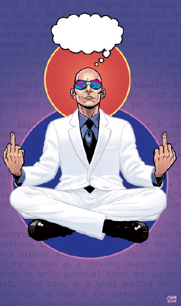
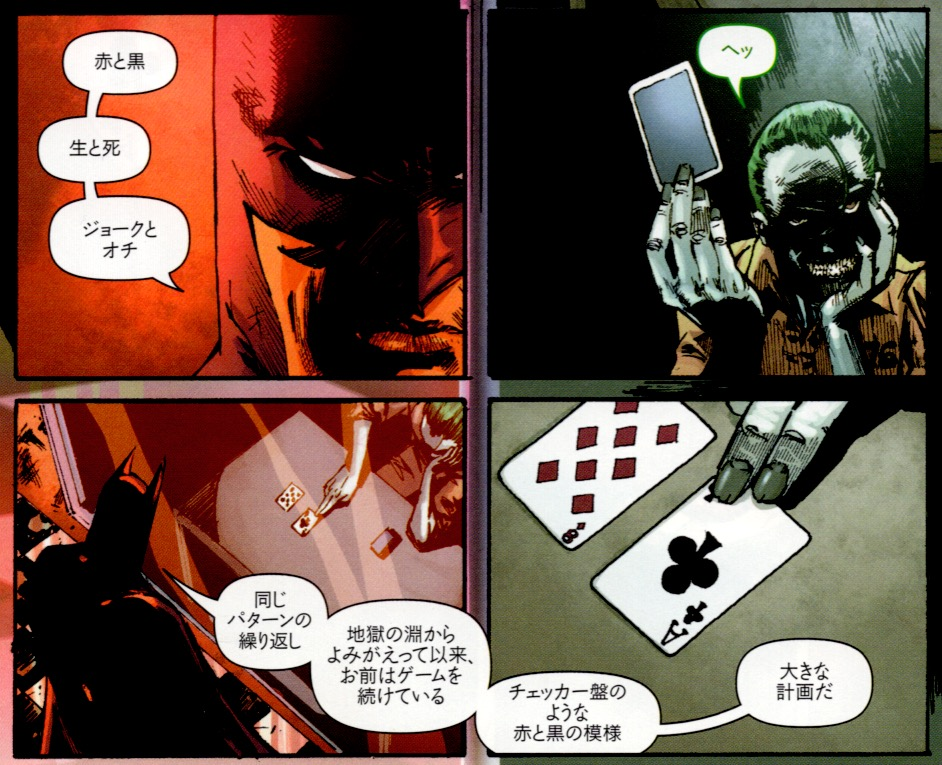
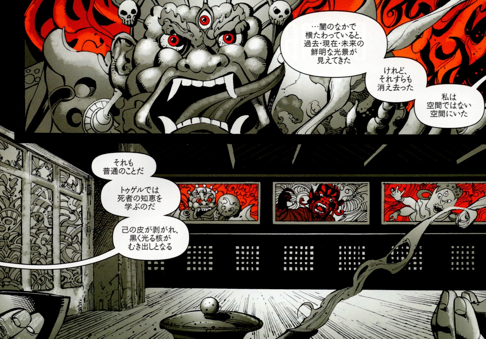

## 1. 『POP MAGIC!』の「深淵」を読む──バットマンは魔術師だった？

まず『POP MAGIC!』の中で書かれていた「深淵（アビス）」を見てみよう。

👉[『POP MAGIC!』](https://github.com/ravensgate-tux/pop_magic_annotation/blob/main/README.md)

---

### 🇯🇵 日本語訳　 — 深淵（アビス）

 

アレイスター・クロウリーは、エゴ的な自己構造の崩壊を「コロンゾン（悪魔333）」として具現化した。この「コロンゾン」は、深淵の全てを喰らう門番とされている。（深淵とは、人間の意識における「体験的な空白」を示す、劇的かつ象徴的な表現だ。）これは、個的なエゴ意識が──存在論的には実在しない「人格」が──「ただの行動戦略」に過ぎないという事実と向き合う代わりに、自己を食い潰し始めるような精神状態に適用される言葉である。

誰しも少しは、この「メガ・コロンゾン領域（Mega-ChoronzonnoznorohC-ageM）」を体験している。アンフェタミンの副作用、発熱、臨死体験、あるいは自我が止まらぬ内省で崩壊する時──そこにコロンゾンの声がある。コロンゾンとは、実存的自己が最後の一息で自分の脳を貪り食らい、底なしの底の謎だけが残るような状態である。その先に進めば、「人格」や「自己認識」といった概念はもはや存続できない。深淵の縁に立たされた「人格」は、そこへ足を踏み出すのを避けるためにあらゆる言い訳をし、何でも言い、何でもやる。西洋的な消費社会に生きる私たちの多くは、死ぬまではコロンゾンに直面しようとすらしない。だが、死の5分前に突如コロンゾンと対峙するのは、エンドルフィンの洪水のなか、非常に脆弱な瞬間である。

だからこそ、「死ぬ前に死ぬ」という儀式── すなわち深淵の探査は、魔術の道における大きな試練のひとつである。

深淵とは、自己意識の限界点にあり、意味がその絶対的反転に飲まれる領域であり、その反転は「コロンゾン酸」として自己を溶かす。ここには、自己／非自己の巨大な境界壁が存在し、意識はそこに叩きつけられて消滅する。深淵とは、アイデンティティ、人種、存在、領域といった概念が、矛盾の激しい炎の中で焼き尽くされる「認識の断絶」なのである。

この深淵を越えた魔術師たちは、人間ではなくなるとされる。なぜなら、自己の崩壊を経て「多重人格的な複合体」として再構成されるからだ。

---

> **実験：**
>
>「深淵の誓い（Oath of the Abyss）」と呼ばれるものは、人格の中にあるコロンゾン的な力と腐食的に遭遇する体験である。これは軽々しく取り組むべきものではなく、長年の魔術修行を経てから挑戦すべき、愚かで華やかな──自己破壊的──儀式である。深淵を渡ることに成功すれば多くの報酬があるが、失敗すれば魔術師は内側から崩壊し、疑念・恐怖・不安に呑み込まれ、コミュニティにすら役立たぬ存在となるだろう。

---

### 🇯🇵 解説

それでは最初の文からひとつずつ見ていこう。最初の文はこれだった。

>アレイスター・クロウリーは、エゴ的な自己構造の崩壊を「コロンゾン（悪魔333）」として具現化した。この「コロンゾン」は、深淵の全てを喰らう門番とされている。（深淵とは、人間の意識における「体験的な空白」を示す、劇的かつ象徴的な表現だ。）

**<解説>**

ここに出てくる「コロンゾン」は有名な魔術師であるクロウリーが<深淵>を越えようとしたときに、遭遇した怪物である。人の魂の上昇を妨げる存在に名前がついたもので、便利だから「クロンゾン」と呼んでいるが、同じ働きをするものは別の呼び方でも良いだろう。『BATMAN R.I.P.』では「ジョーカー」がこの役割を演じている。つまり、アレイスター・クロウリーにとってのコロンゾンは、ブルース・ウィルスにとってのジョーカーと捉えるとわかりやすい。

 

---

それでは、次の文を見てみよう。

>これは、個的なエゴ意識が──存在論的には実在しない「人格」が──「ただの行動戦略」に過ぎないという事実と向き合う代わりに、自己を食い潰し始めるような精神状態に適用される言葉である。

**<解説>**

本当は「人格」など存在しないことに気づくと、人間は正気を失う可能性がある。それを教える存在に「コロンゾン」や「ジョーカー」と名前がついていると考えることができる。

---

次の文章はこれである。

>誰しも少しは、この「メガ・コロンゾン領域（Mega-ChoronzonnoznorohC-ageM）」を体験している。アンフェタミンの副作用、発熱、臨死体験、あるいは自我が止まら
ぬ内省で崩壊する時──そこにコロンゾンの声がある。

**<解説>**

この文は少し詩的に表現されているが、誰しも経験のある、自我が曖昧になるような、病気、薬物の影響、心理状態にあるときには「コロンゾンの声がする」と表現することができる。

---

続いて次の文章はこれだ。

>コロンゾンとは、実存的自己が最後の一息で自分の脳を貪り食らい、底なしの底の謎だけが残るような状態である。その先に進めば、「人格」や「自己認識」といった概念はもはや存続できない。深淵の縁に立たされた「人格」は、そこへ足を踏み出すのを避けるためにあらゆる言い訳をし、何でも言い、何でもやる。

**<解説>**

霊的な向上のために「エゴ（自我）」を捨てることを<深淵>を越えると表現する。しかし同時にこれは「自分だ」と思っていたものを捨てることであり、「死」に等しい。あなたがPCだとしたらこれまでの作業を捨てて、工場出荷時に初期化するようなものだ。その恐怖心を煽るのが「コロンゾン」だと言える。

---

次の文章はこれである。

>西洋的な消費社会に生きる私たちの多くは、死ぬまではコロンゾンに直面しようとすらしない。だが、死の5分前に突如コロンゾンと対峙するのは、エンドルフィンの洪水のなか、非常に脆弱な瞬間である。

**<解説>**

死の際には自我の崩壊は誰にでも訪れる。西洋には死ぬ前に死の準備をするような行為は稀だが、ブルース・ウィルス＝バットマンはチベットでゾクチェンの修行を行っている。

 

---

次の文章は、これである。

>だからこそ、「死ぬ前に死ぬ」という儀式── すなわち深淵の探査は、魔術の道における大きな試練のひとつである。ゾクチェンのトゥゲルはこの修行である。

**<解説>**

魔術修行の中で使われる生命の樹を上昇することで人間はHGA（高次の存在）との合一を果たすが、その前には<深淵>が横たわっている。これが大きな試練であるのは、ここまで述べた「コロンゾン」の働きがあるからである。

---

さて、次の文章である。

>深淵とは、自己意識の限界点にあり、意味がその絶対的反転に飲まれる領域であり、その反転は「コロンゾン酸」として自己を溶かす。ここには、自己／非自己の巨大な境界壁が存在し、意識はそこに叩きつけられて消滅する。

**<解説>**

自己の輪郭が崩れはじめ、世界との境が曖昧になるとき、人は「自分が自分でなくなる」感覚に直面する。この極限状態が〈深淵〉であり、そこでは「意味」が裏返り、これまで頼っていた認識の軸そのものがひっくり返る。

---

そろそろ終盤。次の文章である。

>深淵とは、アイデンティティ、人種、存在、領域といった概念が、矛盾の激しい炎の中で焼き尽くされる「認識の断絶」なのである。

**<解説>**

この<深淵>は境界であって、この下では性別、人種、職業、所属など様々なラベルが存在できる。しかし深淵を超えて上昇すれば、人間を区別するものは消える。工場出荷時のPCのようなもので人格は存在しなくなる。

---

さて、説明の最後の文である。

>この深淵を越えた魔術師たちは、人間ではなくなるとされる。なぜなら、自己の崩壊を経て「多重人格的な複合体」として再構成されるからだ。

**<解説>**

深淵を越えるというのは「今までの自分」が終わることを意味する。そこから戻ってきた魔術師は、かつての単一的な「私」ではなくなる。人格は壊れ、再構成される。その結果、新たな存在は「多重人格的な複合体」となり、いくつもの視点や意志を内包した存在になるのだ。

---

ここまでで説明文は終了。あとは「実験」の解説である。実験の文章はこのようなものであった。

> **実験：**
>
>「深淵の誓い（Oath of the Abyss）」と呼ばれるものは、人格の中にあるコロンゾン的な力と腐食的に遭遇する体験である。これは軽々しく取り組むべきものではなく、長年の魔術修行を経てから挑戦すべき、愚かで華やかな──自己破壊的──儀式である。深淵を渡ることに成功すれば多くの報酬があるが、失敗すれば魔術師は内側から崩壊し、疑念・恐怖・不安に呑み込まれ、コミュニティにすら役立たぬ存在となるだろう。

**<解説>**

このZineの目的であるグラント・モリスン『BATMAN R.I.P.』で<深淵>を解説することができるのはブルース・ウェイン＝バットマンがこの実験で語られる「深淵の誓い（Oath of the Abyss）」をチベット仏教のトゥゲルを通じておこなったからである。つまりグラント・モリスンと同様にブルース・ウィルスは魔術師なのである。これで全文である。ここまでで、グラント・モリスン『POP MAGIC!』の「深淵（アビス）」の振り返りとしたい。

---

© 2025 知られざる呪術師（Le Sorcier Inconnu）  
本ドキュメントは [Creative Commons BY-SA 4.0](https://creativecommons.org/licenses/by-sa/4.0/deed.ja) に基づき公開されています。
