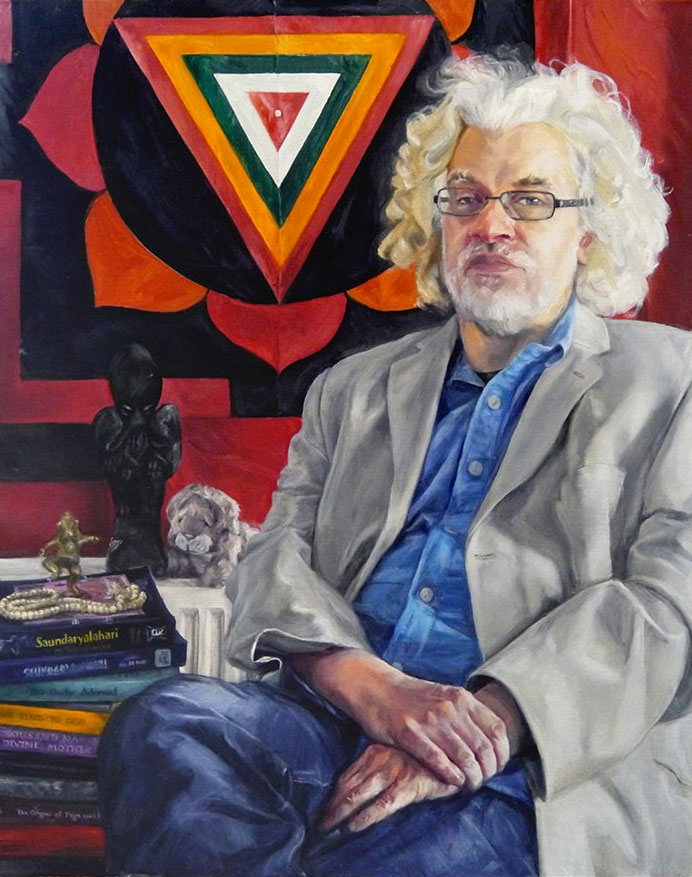
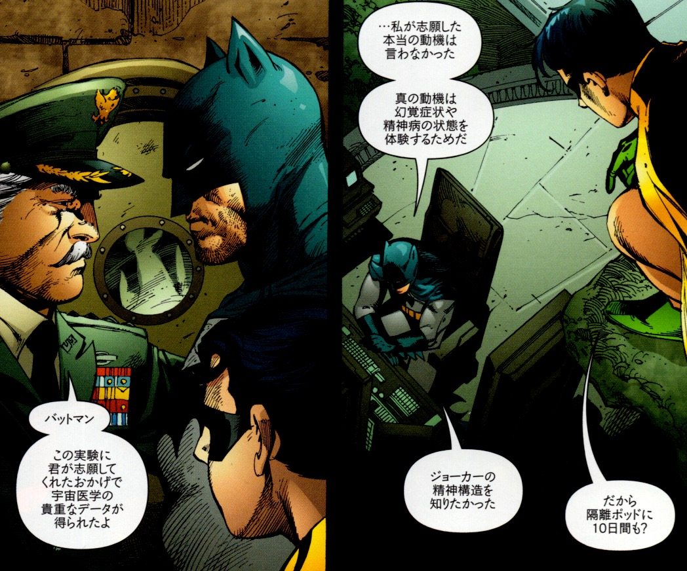
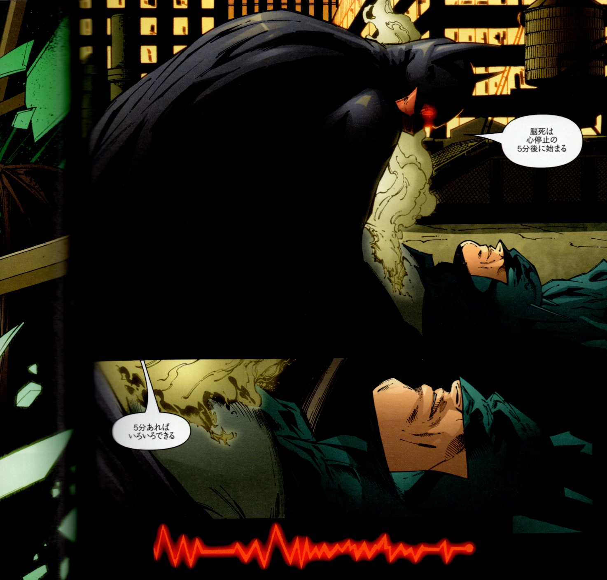

## 2.　『現代シャーマニズムの技法 第1巻』の「降下」を読む──バットマンはシャーマンなのか？

まず『現代シャーマニズムの技法 第1巻』の中で書かれていた「降下」を見てみよう。

👉[『現代シャーマニズムの技法 第1巻』](https://github.com/ravensgate-tux/hine_modern_shamanism/blob/main/README.md)

---

### 🇯🇵 日本語訳　 — 降下

 

シャーマンとは何者か？──それは「そこへ行って、帰ってきた者」のことである。いわゆる〈冥界下り（Going Down）〉、細い糸一本を頼りに迷宮へ降りていく、意図された下降の旅のことである。この呼び声はすべての人に訪れる。たどり着く者もいれば、たどり着けない者もいる。だが、呼び声が止むことはない。絶えず、下へ、下へと誘うのだ。

これは大いなる変容のサイクルである。頂点、平地、谷間──その移ろいを耐え、やがて歓迎することすらできるようになる。変化とは、生き、適応し、成長するために必要なものなのだ。脳の奥を狂気がかじっているかのように感じることは辛いが、芋虫だって蛹になるときには似たような感覚を味わっているのかもしれない──細胞レベルで、変化することが「当然」とされるプロセスに突き動かされて、未知へと向かっていくのだから。

私たちの文化は、このプロセスに対してほとんど何の準備も与えてこなかった。それどころか、これは「狂気」として烙印を押され、〈治療〉と称される光る注射針と、自己満足げな心理学者によって排除される──彼らは、私たちの秘密の夢や野性への渇望を、まるで「誤り」であるかのように説明してしまうのだ。召喚の声は、想像力に限界を設けようとする者たちによって、絶えず鈍らされている。

「それは現実じゃない。ただの想像だ」「空想ばかりしていないで」「現実逃避してるんじゃないか」……そんな言葉ばかりだ。そうして私たちは、まずは嘘から逃れ、次に自分自身からも逃れ、粉々に砕ける――一度きりではなく、何度も何度も。崩壊（ブレイクダウン）ではない。突破（ブレイクスルー）なのだ……でも、それは一体どこへ向かうのか？

どれだけ長くそこにとどまっていようと――一週間でも、一年でも、一日でも――いずれまた戻ってくることになる。ならば、風景に慣れておいたほうがいい。召喚が来れば、きっとわかるはずだ。その旅は、何年もかかるかもしれない。途中で友や味方に出会い、試練に直面し、ときには打ちのめされることもあるだろう。「必要性（ネセシティ）」というものは、とんでもなく厳しいやつなのだ。覚えておけ――舟を降りてはいけない。最後まで行くつもりでなければ、だが。引き金となるのは、毎回異なる。危機、ドラッグ、グノーシス、死の間際の体験……いずれも、味方たちが扉を開くための手段なのだ。ただし、足から突っ込んで行ったら、リスクは大きい。実のところ、「死」は極めて重要な要素なのだ。だから、死にすべてを委ねるのだ。死の腕に身をまかせれば――きっとまた、あなたを送り返してくれるだろう。もしそうでなければ……まあ、次の機会を待つしかない。

何もできない時にできること――それは、手放すことだ。コントロールを委ねてしまうのだ。底なしの崖の上にぶら下がって、一本の枝にすがっている自分を想像してみよう。深呼吸して、指を交差させて、そして、身を投げるのだ。降下するなら、徹底的に行くしかない。じっと座って、何もしないというのは、私たちにとってとても難しい。だが、時にはそれが最善の選択肢になる。「行動すべき時」と同じくらい、「行動すべきでない時」を知ることは重要だ。その判断は、自分自身と周囲の状況に深く注意を払うことでしか得られない。私たちは言葉や記号の海に生きているが、首から下には信頼できる味方――そう、〈身体〉がある。

このプロセスには、いくつもの名前がついている──「魂の暗夜（Dark Night of the Soul）」「スランプ（the Hump）」「アポピスの位相（the Apophis phase）」「ニグレド（Nigredo）」──けれども、どれも本質的には同じことを指している。これは〈試練の時〉なのだ。そこに持ち込めるものは何もない。信念も、教義も、武器も、執着も──すべて置いていくしかない。ここから先は、君ひとりだ。

……ちょっと妙な語りになってるかもしれない。まあ、悪いね。今回は頭じゃなくて〈足〉で書いてる感じなんだ。伝えたいのは、「手軽に噛み砕けるテキスト」じゃなくて、「感触」なんだよ。ここで話しているのは、「イニシエーション（通過儀礼）」についてなんだ。この言葉については、さんざん〈たわごと〉が語られてきた。昔よくいた、ちょっとイカれた連中（最近はあまり見かけないけど）──「君は“イニシエイト”じゃないから話せないんだ」とか、「君はまだ“ネオファイト”だから、その儀式の詳細は教えられないね」なんて言ってくる連中さ。だけどさ、俺はW.H.スミスに行って、ファラーの最新刊からその儀式の詳細を全部読めたんだけどね。

つまりこういうことさ──「俺はガーディアン読んでるからお前より偉い。ザ・サンなんか読む奴とは違うんだ」って言ってるのと同じだよ。「へっ、君はオレの仲間にはなれないぜ！」ってわけ。

要するに、「イニシエーション」とは、自分が〈変化の節目〉にたどり着いたことを〈意識的に認める〉ということだ。その地点に立っていると自覚すること、それが何よりも重要なんだ。そして、自分がこれから〈自己変容の可能性〉に満ちた時期に入っていくという認識を持つこと。すべてはそこから始まる。儀式的な演出は、必須じゃない。だけど、多くの人にとっては、内的・外的なプロセスを〈劇的に示す〉手段として、有用で（そしてけっこう楽しく）感じられるだろう。もちろん、特定のグループやカルトの信仰体系に沿って「イニシエーションを受ける」こともできる。けれど、最も深いレベルでの通過儀礼とは──それは「自分自身へのイニシエーション」だ。誰かが案内人や助言者になることはできても、それを〈あなたの代わりに通過してくれる〉ことはできないんだ。

世界のあいだを通り抜けるには、たいてい〈カタルシス〉──動揺、試練、あるいはテスト──を伴う。それを引き起こすために必要な「攪乱」こそが、深みに飛び込むための〈トリガー〉となる。この契機は、自分自身の成長のための訓練の一環として現れることもあれば、「偶然」の出来事として降ってくることもある。あるいは、他者によって意図的に引き起こされることすらある。この最後の方法──誰かを〈通過儀礼〉へと導く「ひと押し」──こそが、イニシエーター（導き手）の役割の中でも、最も困難で、そして最も報われる瞬間だ。絶妙なタイミングで、「今だ」と見極めて〈軽く触れ、そして手を放す〉。なぜなら、いったん誰かが〈能動的なイニシエーション〉を始めてしまえば、外からできることはほとんどない。せいぜい耳を傾けるか、あるいは必要なら、黙って見守ること。それだけだ。──でも、いつかその人が、同じことをあなたにしてくれるかもしれない。

ある意味で、イニシエーションとは〈死への擬態〉である。これまでしがみついていた多くの執着──立場、信条、アイデンティティ──は、たいてい手放さざるを得なくなる。そして、自分がいかに愚かだったかを思い知らされて、自己評価が大きく揺らぐこともある。そのとき芽生えるのが、「自分は部外者だ」という感覚だ。そしてこの感覚に固執すると、「選ばれし者」や「メイガス（魔術師）」、「反逆者」など、魅力的に映る役割を演じ始めてしまう危険がある。だが、選択はあくまであなた自身に委ねられている──〈虚無にとどまる〉のか、それとも〈誰かに手を差し伸べる〉のか。

私たちは〈イニシエーション（通過儀礼）〉のサイクルを、神話世界に登場するスケールの大きなイメージによって理解している。この旅は、おとぎ話、演劇、焚き火のそばで語られる物語、そしてサイエンス・フィクションに至るまで、あらゆる形式で世界中に語り継がれてきた。私が特に気に入っているのは、『ジャンピング・マウスの物語』と、映画『地獄の黙示録』だ。この旅のプロセスは、だいたいこんなふうに進行する──召喚、旅立ち、川船、混沌への旅、仲間や一時的な同盟者との出会い、試練と障害、「変化の担い手」との最終的な邂逅、地上への帰還、そして共同体への帰還……。──ただし、戻ってきたその時、あなたは〈誰〉になっているのだろう？

もちろんこれは、タロットの〈大アルカナ〉が描いている旅そのものだ。だがこれは、私たち全員に通じる〈永遠の旅〉でもある──愚者（フール）、ルーク・スカイウォーカー、私、そしてあなた──誰もがその道を歩いている。この旅に〈終わり〉はない。私は〈ユートピア〉も〈完璧〉も、あるいは永遠に至福に浸る「真の自己」なんてものも信じていない。重要なのは──〈求め続けること〉だ。

この本で紹介した技法は、けっして最終的なものではない。あくまで〈始まり〉にすぎない。このテーマについて語るべきことは、まだたくさんある。だが、それらはきっと、他の書物のなかに見つけられるはずだ。おそらくこの本をもっとも有効に使う方法は、興味を共有できる仲間を見つけ、一緒に技法を探究していくことだろう。〈華美な道具〉など必要ない。今この段階で必要なのは、ボディマインド（身体と精神）だけだ。そして、誰かとともに進むなら──あなたの学びはもっと早く、もっと楽しくなるはずだ。

---

## 🇯🇵 解説

 

この長文を踏まえた上での結論は──バットマンは「シャーマン」としての条件を満たしていると考えることができる。ただし、それは伝統的なシャーマンではなく、都市神話的・象徴的なシャーマンであり、イニシエーション（通過儀礼）を生きる存在としてのシャーマンである。

✅ バットマンがシャーマンである理由
1. 「冥界下り（Going Down）」を経験している
ブルース・ウェインは『BATMAN R.I.P.』で人格崩壊し、記憶喪失に陥り、自分が誰かも分からぬままゴッサムの底辺をさまよっている。

これは「意図された下降の旅」「帰還する者」＝シャーマンの定義にぴったりと重なる。

2. 自己崩壊からの再構築（ズー・イン・アール）
バットマンはズー・イン・アール人格というバックアップ人格を発動させ、自己を一時的に再構成する。

これはまさに「自己の死」と「再構築（リボーン）」であり、ニグレドや魂の暗夜（Dark Night of the Soul）をくぐり抜けたイニシエーションのプロセスそのものである。

3. 「舟を降りるな」＝プロセスを最後まで生き抜いた者
上記テキストで語られる「舟を降りるな」「最後まで行け」「すべてを手放せ」というイニシエーションの掟に対し、ブルースは抗わず、全プロセスを通過する。

そして最後にはバットマンとして帰還し、以前よりも強くなっている──これは神話的英雄の「帰還」と重なる。

4. 帰還し、コミュニティに奉仕する
シャーマンは旅の後、コミュニティに「癒し」や「知恵」をもたらす存在である。

バットマンは「象徴」として再誕し、ゴッサムの守護者として機能し続ける。これは「世界へ戻ってくる英雄」の典型といえる。

🔄 一方で、伝統的なシャーマンとの違い
項目	シャーマン	バットマン
精神世界との交信	魂の旅・霊的ビジョン	幻覚や精神破壊のなかで象徴的洞察
集団との関係性	部族・共同体のために働く	都市・社会への自己犠牲的奉仕
儀式性	通過儀礼・ドラム・変性意識	ゾクチェン的準備／ズー・イン・アール人格による儀式的再構成
召喚の形式	病・夢・霊的召命	トラウマ・心理操作・記憶の断絶

→ このような形式は異なれど、本質は共通しているといえる。

🟦 結論：バットマンは都市型シャーマンである
『BATMAN R.I.P.』を読む限りにおいて、バットマンはシャーマニックなイニシエーションを通じて人格崩壊と再統合を経ており、都市の無意識と戦う象徴的シャーマンと捉えることができる。

特にグラント・モリスンが描いたバットマンは、読者に「この旅は君の旅でもある」と語りかけており、まさに近代の神話的シャーマン像を体現している。

---

 

---

© 2025 知られざる呪術師（Le Sorcier Inconnu）  
本ドキュメントは [Creative Commons BY-SA 4.0](https://creativecommons.org/licenses/by-sa/4.0/deed.ja) に基づき公開されています。
