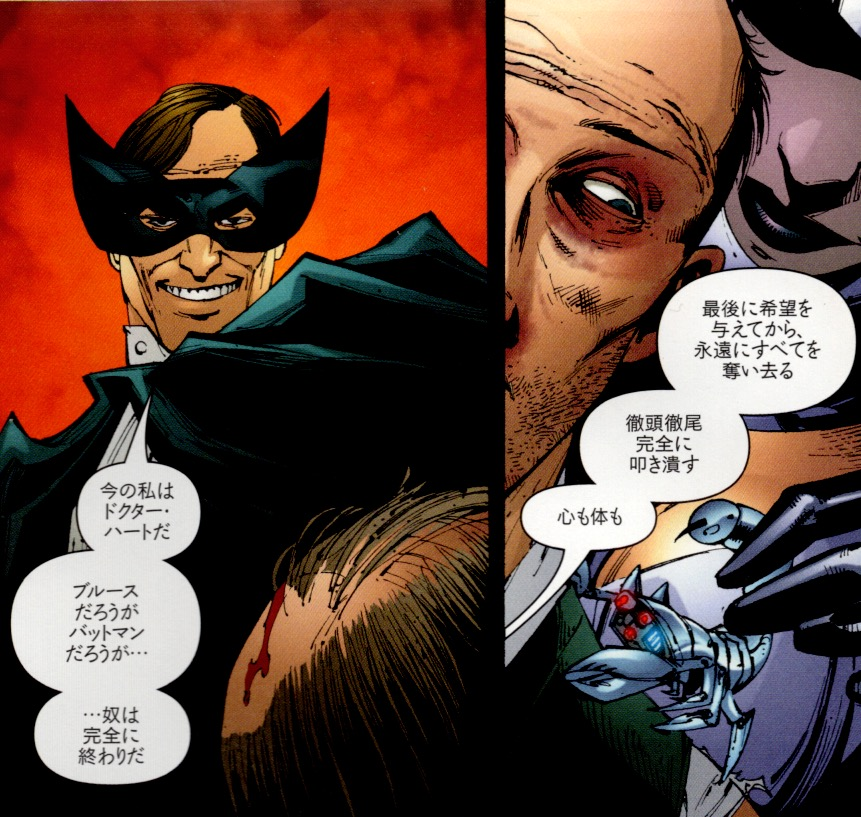

## 3. 『BATMAN R.I.P.』のストーリー

---

**1. ブラックグローブの陰謀** 
ゴッサムの裏社会を操る秘密結社「ブラックグローブ」が、バットマン＝ブルース・ウェインの精神を破壊しようとする陰謀を進めていた。ブルースの過去を探る調査と同時に、彼の周囲に異常が起こり始める。

 

**2. ブルース人格の崩壊** 
ブルースは謎の女性ジーナ・リバーロと恋に落ちるが、彼女はブラックグローブの一員だった。信頼していた人物に裏切られた衝撃と心理的操作により、ブルースは精神的に追い詰められていく。

 

**3. 記憶喪失と放浪** 
精神操作の結果、ブルースは記憶を失い、ゴッサムの街をさまよう。自分が誰なのかも思い出せず、ホームレスのような姿で漂流する日々を送る。

 

**4. チベット仏教の修行と非常用人格の覚醒** 
ブルースはかつて自らが構築していた緊急用人格「ズー・イン・アール」として覚醒する。非常時に備えたバックアップ人格が発動し、彼はバットマンとしての行動を再開する。

 

**5. ジョーカーとの対峙** 
精神崩壊寸前のブルースは、ジョーカーと対峙する。ジョーカーは彼の精神の限界を試す存在として、象徴的に立ちはだかる。

 

**6. ブラックグローブとの決着** 
ズー・イン・アールの人格が限界を迎える中で、ブルースは徐々に元の記憶と人格を取り戻す。ブラックグローブの本拠地に突入し、組織を打ち倒す。

 

**7. バットマンとしての帰還** 
ブルース・ウェインは正気を取り戻し、バットマンとして再びゴッサムの守護者となる。深い精神の混乱を乗り越えた彼は、かつてよりも強固な意志で立ち上がる。

 

---

© 2025 知られざる呪術師（Le Sorcier Inconnu）  
本ドキュメントは [Creative Commons BY-SA 4.0](https://creativecommons.org/licenses/by-sa/4.0/deed.ja) に基づき公開されています。
