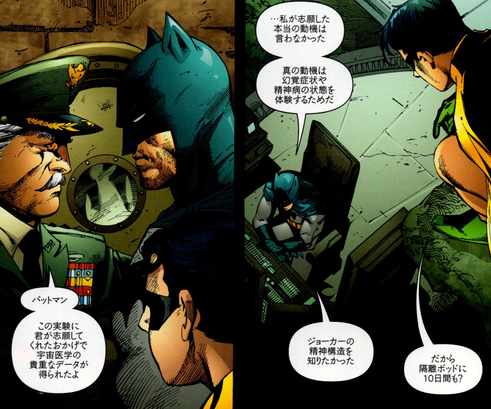
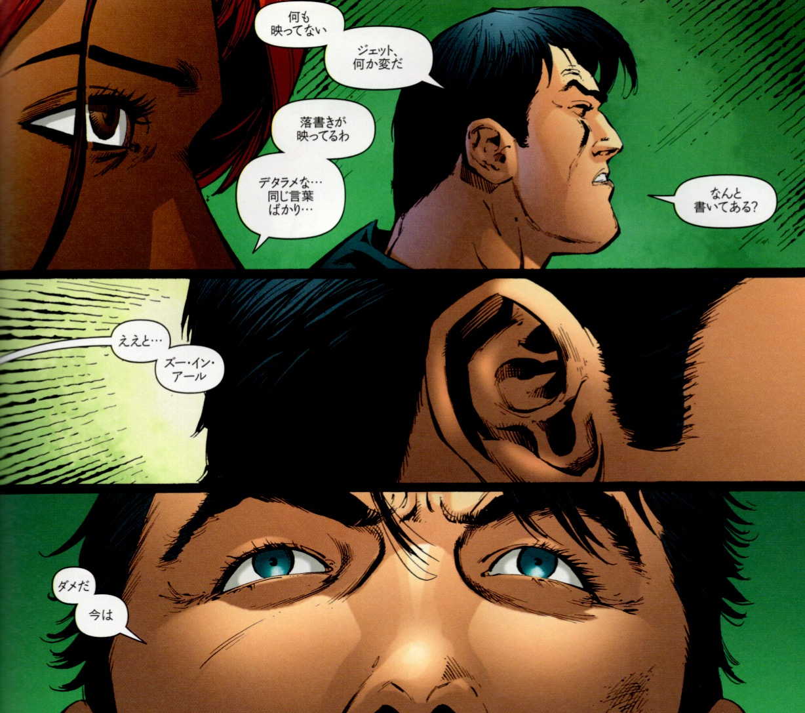

## 4. 人格崩壊の起動コマンド

 

ブルース・ウェインの人格が完全に崩壊したとき、表層人格──すなわち「バットマン」は沈黙する。これは、ブラックグローブのDr.ハートによって精神構造に埋め込まれた“破壊コマンド”が作動したためである。このコマンドのキーとなるのが、「Zur-En-Arrh（ズー・イン・アール）」という言葉である。かつて軍の実験に協力し、10日間の隔離状態を経験したブルースの心には、この言葉がトラウマ的トリガーとして仕込まれていたのだ。

この精神的攻撃によりブルースの自我は崩壊し、記憶を失い、意識は街を彷徨う浮浪者へと変化する。しかし、その崩壊の奥底で、ブルースはかつて自らの手で構築していた“リブート人格”──ズー・イン・アールに再接続される。きっかけとなったのは、浮浪者から託された壊れた「バットラディア」である。この異物は象徴的な“パーソナル・シジル”として作用し、再起動のアンカーとなった。

ズー・イン・アール人格は、感情や倫理の制限が取り払われ、戦闘能力と論理判断のみに特化した“セーフモード人格”である。これはまさに、トラウマや危機に直面したときに作動するバックアップOSであり、ゾクチェンにおける“トゥゲル（死のシミュレーション）”に相当する精神的訓練の成果でもある。

つまり、ズー・イン・アールとは「破壊コマンド」でもあり、「リブート人格」でもある。ブルースの精神に仕組まれた陰謀と、それに対抗する形で自ら仕込んだ緊急復元人格が同じ名前を持つことにより、物語はより複雑で象徴的な多層構造を帯びることになる。

 

---

© 2025 知られざる呪術師（Le Sorcier Inconnu）  
本ドキュメントは [Creative Commons BY-SA 4.0](https://creativecommons.org/licenses/by-sa/4.0/deed.ja) に基づき公開されています。
