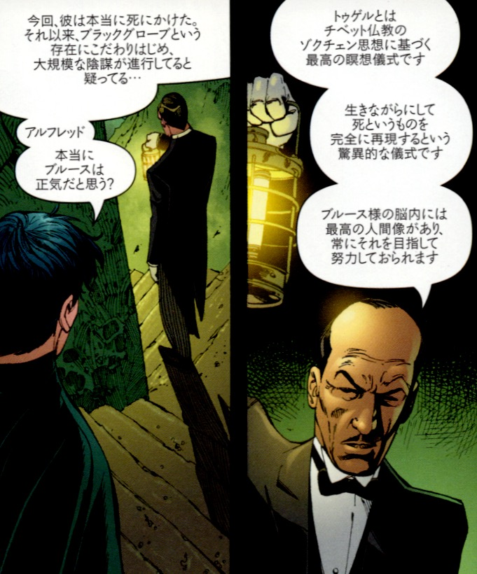

## 5. チベット仏教のトゥゲル

 

『BATMAN R.I.P.』の物語において、ブルース・ウェインはかつてチベットでの修行を通じて、自らの死を擬似的に体験し、精神的再起動のプログラムを設計したとされる。その中核にあるのが、「ゾクチェン」と呼ばれるチベット仏教の高度な教義に基づく修行法──トゥゲル（thod rgal）である。

トゥゲルとは、ゾクチェンの中でも最終段階に位置づけられる「光のヴィジョン」の修行法である。修行者は暗闇の中にこもり、外界からの刺激を遮断することにより、内なる光を視覚化する。これは、死の瞬間に人が体験するとされる「クリアライト（原初の光）」の再現を意図したものである。

この修行を通じて、修行者は自己という幻想の構造がいかに脆弱で、仮構であるかを目の当たりにする。意識は次第に形を失い、思考や記憶、役割、名前すらも崩れ落ちていく。その過程で、「死んでいないが死を体験する」という擬似的なエゴ・デス（自己崩壊）が生じる。

ブルース・ウェインがこの修行を通して得た成果こそが、「ズー・イン・アール」という人格である。これは、トゥゲルの実践によって「一度死んだ者」としての覚悟を得たブルースが、精神崩壊の非常時に備えて設計した意図的な再起動人格である。つまり、ズー・イン・アールは死と再生のプロセスの中で生まれた「光の戦士」なのである。

バットマンの物語の文脈では、トゥゲルは単なるエキゾチックな背景設定ではなく、「人格のリブート」＝「魔術的変容」の原型として重要な位置を占めている。それは、現代魔術における「アビス通過」や「シャーマニック・ディセント（冥界下り）」とも重なり、物語の深層において強烈なイニシエーション（通過儀礼）を象徴している。

---

© 2025 知られざる呪術師（Le Sorcier Inconnu）  
本ドキュメントは [Creative Commons BY-SA 4.0](https://creativecommons.org/licenses/by-sa/4.0/deed.ja) に基づき公開されています。
