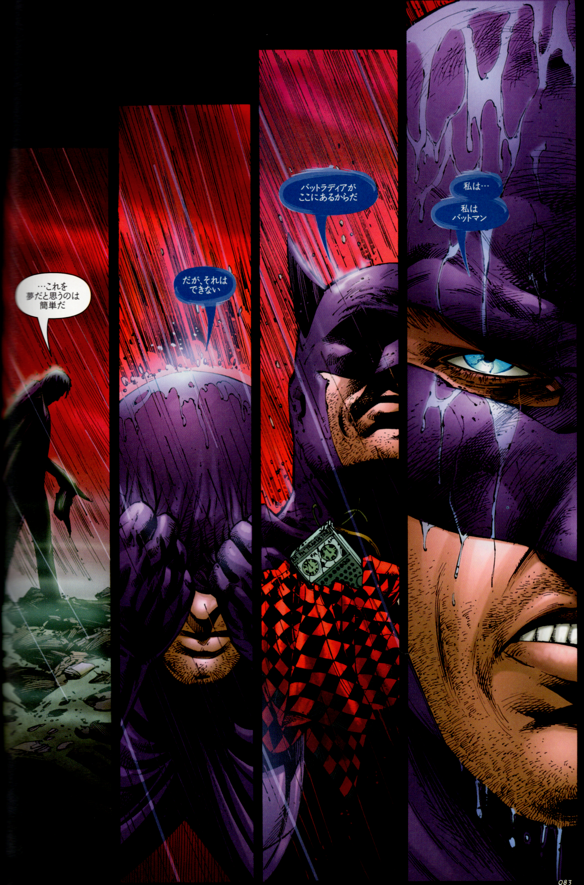

## 6. バットラディア

 

ブルース・ウェインの人格が完全に崩壊したとき、表層人格──すなわち「バットマン」は沈黙する。ここで起動するのが、あらかじめ設定された緊急時人格ズー・イン・アール（Zur-En-Arrh）である。

このプロセスは、情報科学で言うところの「フェイルセーフOSの再起動」にも似ている。従来の人格構造がクラッシュした際、最小限の論理判断と戦闘能力を維持する“ベアボーン人格”が、自己修復的に起動するのだ。

起動のきっかけは、「Zur-En-Arrh（ズー・イン・アール）」という言葉である。この単語はブルース自身が“起動フレーズ”として埋め込んだものであり、いわばNLP的トリガー──「自己誘導型アンカー」として機能している。催眠やトランス誘導において、特定の言葉やジェスチャーが心理状態を切り替えるのと同様、ズー・イン・アールという言葉はブルースの精神OSにおける「人格切替スイッチ」である。

このリブート人格には「記憶」の多くが遮断されており、感情や倫理の制限も低く設定されている。まるで“セーフモード”で立ち上がったPCのように、最小限のドライバで生き延びることだけを目的にした状態である。

そしてこのトリガーは、ゾクチェンにおける“死の擬似体験（トゥゲル）”に通じる──あらかじめ「崩壊のシナリオ」を仮想的に実行し、深淵の中から「再起動可能な核」を確保するための修行だ。ズー・イン・アール人格は、単なる暴走ではない。意図的に設計されたサブOSであり、最悪の瞬間に“自己を救済する”構造をもっている。

このように見ると、ズー・イン・アールの人格構築とは、まさに内的なプログラミング言語によるエマージェンシーAIの実装であり、「魔術」「NLP」「認知心理」「宗教的イニシエーション」が交差する、極めて現代的な霊的技術であると位置づけられる。

---

© 2025 知られざる呪術師（Le Sorcier Inconnu）  
本ドキュメントは [Creative Commons BY-SA 4.0](https://creativecommons.org/licenses/by-sa/4.0/deed.ja) に基づき公開されています。
