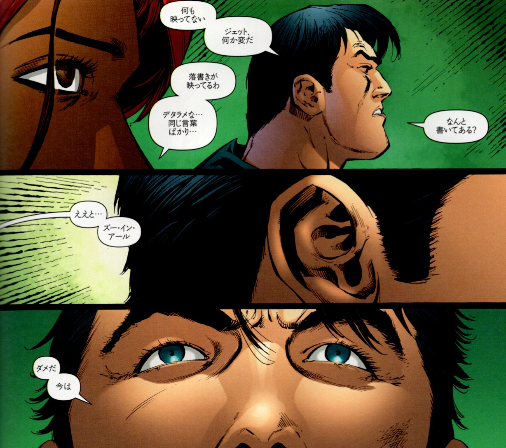

## 6. バットラディア

 

## 4. 人格崩壊の起動コマンド

 

バットラディア──壊れたラジオに仕込まれた起動装置
『BATMAN R.I.P.』におけるバットラディアは、表面的には壊れた小型ラジオのようにしか見えない。しかしこのアイテムこそが、ブルース・ウェイン＝バットマンの再起動プロトコルを支える重要な鍵である。

精神崩壊の渦中において、彼が手にしていたこのラジオには、ズー・イン・アール人格を起動・安定化させるためのコードワードと記憶の断片が仕込まれていた。「壊れている」「ただのノイズ」と見える外殻の裏には、バットマンが自らの崩壊を予期し、周到に用意していた人格リブート用の装置が潜んでいたのだ。

作中で「いつか修理してほしい」と告げられるが、実際にはこのラジオは修理の必要がない。壊れているように見えること自体がカモフラージュであり、敵（ブラックグローブ）に発見されずに自己回復システムを隠蔽するための意図的な破損演出なのである。

また、このバットラディアは魔術的象徴（シンボル）としても解釈可能である。魔術師が用いる道具（アソシエーション・ツール）はしばしば、物理的な意味よりも象徴的・心理的効果に重きを置く。バットラディアは、ブルース・ウェインにとっての「自我のコアファイル」であり、意識の中枢から記憶と行動指針を呼び出すトリガーであった。

OS的にいえば、これはBIOSに書き込まれたリカバリユーティリティに相当する。ズー・イン・アールはメモリ上の仮人格にすぎないが、バットラディアはその仮人格を正しく立ち上げるための「鍵」であり、「認証コード」でもある。

壊れたラジオが囁くノイズ、それこそが「かつての自分から未来の自分への通信」だったのだ。

---

© 2025 知られざる呪術師（Le Sorcier Inconnu）  
本ドキュメントは [Creative Commons BY-SA 4.0](https://creativecommons.org/licenses/by-sa/4.0/deed.ja) に基づき公開されています。

---

© 2025 知られざる呪術師（Le Sorcier Inconnu）  
本ドキュメントは [Creative Commons BY-SA 4.0](https://creativecommons.org/licenses/by-sa/4.0/deed.ja) に基づき公開されています。
