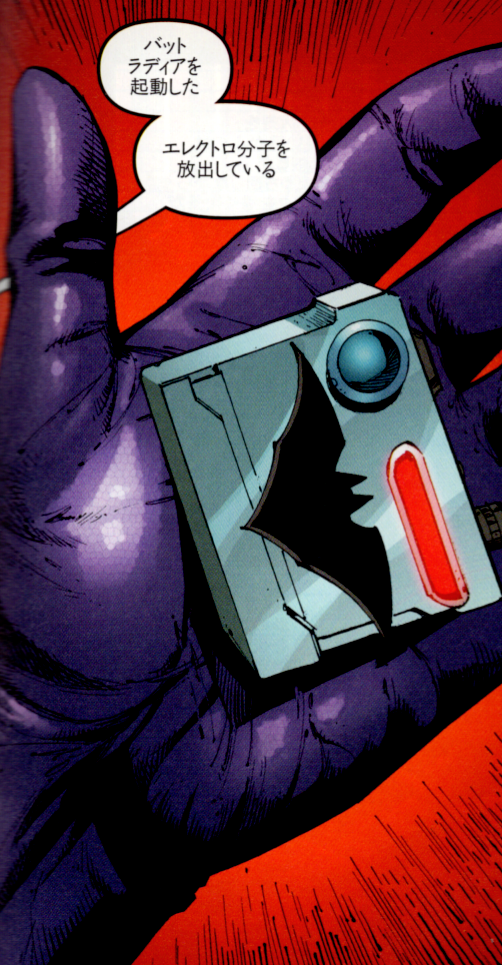

## 6. バットラディア

 

バットラディア──壊れたラジオに仕込まれた起動装置
『BATMAN R.I.P.』におけるバットラディアは、作品中実際には壊れた小型ラジオである。

精神崩壊の渦中において、彼がホームレスから受け取ったラジオは、ブルースが記憶を取り戻した時に発疹装置が取り付けられた。「壊れていた」ラジオは、かつてバットマンが自らの崩壊を予期し、周到に用意していた人格リブート用の「バットラディア」を象徴的に思い出させたのだ。

 

また、このバットラディアは魔術的象徴（シンボル）としても解釈可能である。魔術師が用いる道具（アソシエーション・ツール）はしばしば、物理的な意味よりも象徴的・心理的効果に重きを置く。バットラディアは、ブルース・ウェインにとっての「自我のコアファイル」であり、意識の中枢から記憶と行動指針を呼び出すトリガーであった。

OS的にいえば、これはBIOSに書き込まれたリカバリユーティリティに相当する。ズー・イン・アールはメモリ上の仮人格にすぎないが、バットラディアはその仮人格を正しく立ち上げるための「鍵」であり、「認証コード」でもある。壊れたラジオが囁くノイズ、それこそが「かつての自分から未来の自分への通信」だったのだ。

---

© 2025 知られざる呪術師（Le Sorcier Inconnu）  
本ドキュメントは [Creative Commons BY-SA 4.0](https://creativecommons.org/licenses/by-sa/4.0/deed.ja) に基づき公開されています。

---

© 2025 知られざる呪術師（Le Sorcier Inconnu）  
本ドキュメントは [Creative Commons BY-SA 4.0](https://creativecommons.org/licenses/by-sa/4.0/deed.ja) に基づき公開されています。
