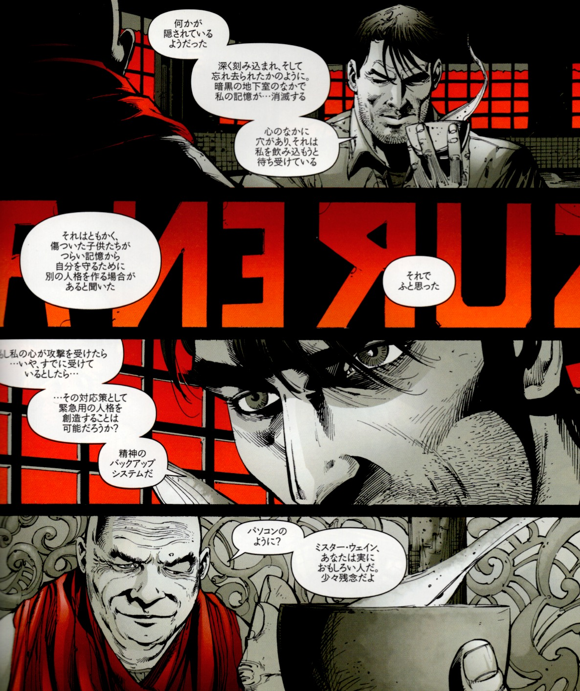

## 7. タルパとしてのバットマイト（Bat-Mite）

 

---

『バットマン：アンド・サン』および『ブラックグローブ』から『BATMAN R.I.P.』に至るまでの物語構造と、ブルース・ウェインの多層的自我の描かれ方を振り返る。

ここでは、象徴的演出やキャラクター配置が、どのように「変容の物語」を下支えしているかを構造的に確認する。

また、「ズー・イン・アール」のキャラクター像が、どのような魔術的自己変容のメタファーになっているかを検討する。

---

© 2025 知られざる呪術師（Le Sorcier Inconnu）  
本ドキュメントは [Creative Commons BY-SA 4.0](https://creativecommons.org/licenses/by-sa/4.0/deed.ja) に基づき公開されています。
