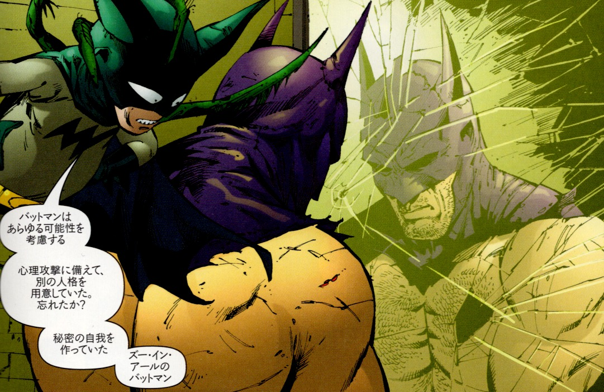
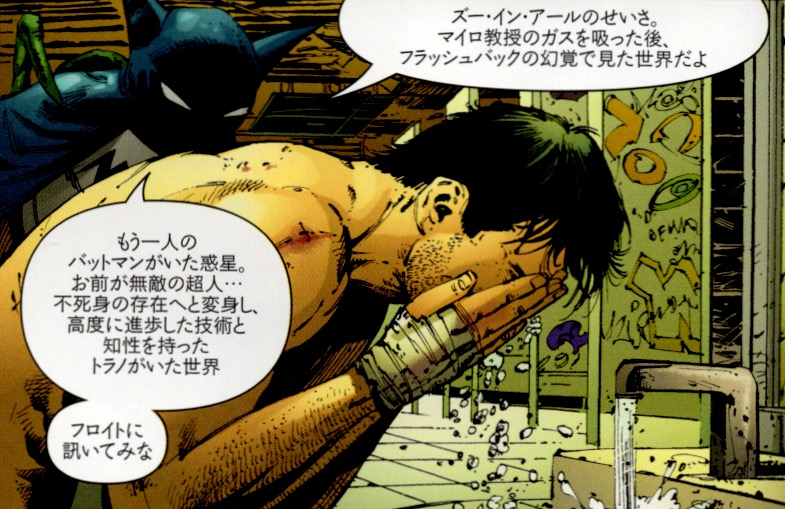

## 8. タルパとしてのバットマイト（Bat-Mite）

 

ブルース・ウェインの精神に現れる「バットマイト」は、単なる幻覚や妄想ではない──それは彼自身が設計した、内的支援モジュールである。
古くはシルバーブロンズ時代のコミックに登場するバットマンの“マスコット”的存在だったが、『BATMAN R.I.P.』におけるバットマイトは全く異なる相貌を見せる。それは人格崩壊の臨界点において起動される、精神世界のナビゲーターであり、ズー・イン・アール人格の起動とともに現れる「守護的な影」なのだ。

このバットマイトは、チベット密教におけるタルパ（tulpa）──すなわち意図的に創られた心の住人、思念体として解釈することができる。ブルースは、自身が精神的に“死”を迎える状況を想定し、あらかじめこの存在をバックアップ人格と連動した「内なる声」として準備していた。

彼の言葉はしばしば壊れたラジオのノイズのように聞こえる──だが、それこそが重要なのだ。バットマイトはブルースの意識が崩壊しかけた場所から、「再起動」の手順を伝えるプロセスガイドなのだ。まるでコンピュータOSに組み込まれたヘルプユーティリティのように、狂気と正気の狭間で、彼はユーザー（＝ブルース）に語りかける。

「お前はブルース・ウェインではない。お前はバットマンだ」──
その言葉は、ブルースのアイデンティティが溶解しきる直前に、最後の核として再構成されるための“ブートローダー”となる。

 

---

© 2025 知られざる呪術師（Le Sorcier Inconnu）  
本ドキュメントは [Creative Commons BY-SA 4.0](https://creativecommons.org/licenses/by-sa/4.0/deed.ja) に基づき公開されています。
